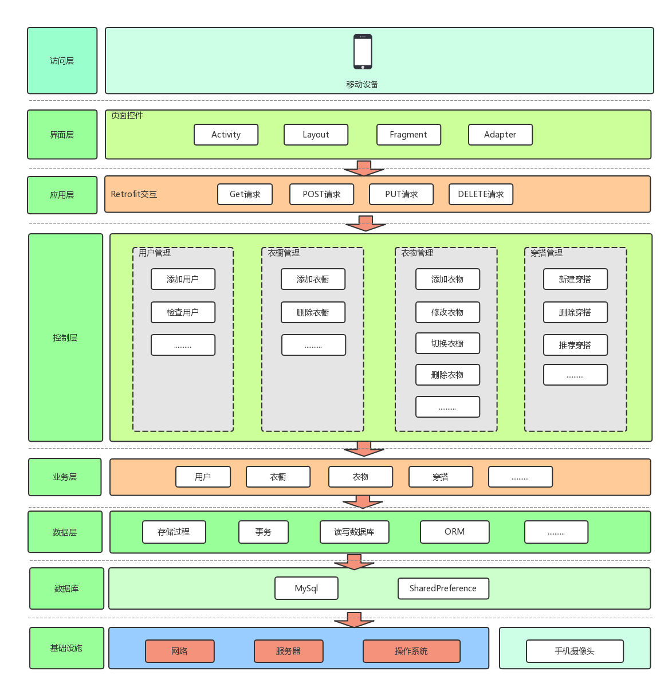
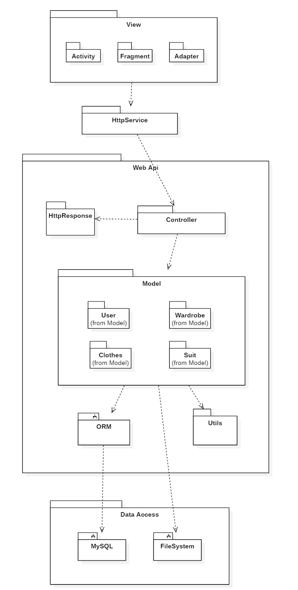

# 概要设计规约

#### 修订历史:

修改或初始编写日期、 SEPG、 版本、 说明、 作者、 评审时间、 评审参与人员、 评审后修改批准日期、确认签字人员


## 一 引言 

### 1.1 概要设计依据

1）架构设计和数据库设计是需求分析规约中数据建模的分析类图细化得到的；

2）接口设计是基于需求规约中的用例描述和用例图，以及需求分析规约中功能建模的活动图、行为建模的状态图和序列图；

3）由需求工程到概要设计是根据软件工程课程课本中的方法进行设计。

### 1.2 参考资料 

[1] RESTful API – Wiki : https://en.wikipedia.org/wiki/Representational_state_transfer

[2] Material Design : https://material.io/design/guidelines-overview/

[3] Pressman R S. Software Engineering A Practitioner's Approach[M]. Seventh Edition.
McGraw- Hill Higher Education, 2008.

### 1.3 假定和约束 

- 发布时间 ：2018年12月25日发布“Valet”智能衣橱APP测试版 
- 系统要求： Android 7.1.1及以上版本 
- 开发条件：成员自备开发使用电脑，并配置相关开发环境
- 开发效率：采用SCRUM敏捷开发模型，开发冲刺期间避免外界打扰。团队高度自治，队员们熟悉开发过程中涉及到的各种技术，紧密合作，确保每个迭代都朝着最高目标推进。
- 小组合作：为了加强小组之间的交流并且节约时间，除了线下讨论，还采用线上开会交流，讨论。 
- 代码托管：为了充分实践软件工程的思想，对项目进行平台化、流程化管理。使用 github进行代码提交、合并、托管，产生最新最完整版的代码。 

## 二 概要设计

### 2.1 系统总体架构设计 

本系统采用MVC为总体框架，其中视图层位于安卓手机端，控制层和模型层位于服务器端，力求实现用户界面和业务逻辑的分离，以增强代码的可扩展性和灵活性。前后端接口采用RESTful风格，服务端采用.Net Core平台Web Api框架，使用SqlSugar等ORM框架对MySQL数据库进行访问和操作。



#### 2.1.1 基础设施层

本系统的基础设施层包括服务端和手机端硬件。其中手机端硬件主要是关于用户的手机摄像头，用户的手机摄像头是系统获取拍照图片功能的硬件基础。服务端基础设施包括服务器的网络连接，服务器及服务器的操作系统。以上的硬件设施为系统提供服务实现功能的最底层基础。

#### 2.1.2数据层及数据库层

本系统采用MySQL关系型数据库作为存储系统运行相关信息的工具。其快速灵活以及开源免费的特点十分适合本项目的性能与成本控制要求。

后端软件使用SqlSugar等ORM框架实现对象与数据库内容的映射以简化对数据库的访问和操作，并将事务管理等数据库操作封装起来以提高代码的灵活度和复用性。

#### 2.1.3 业务层

业务层对应MVC架构中的模型层，实现了系统所有功能的业务逻辑。通过数据层提供的数据接口获取需要的数据，根据具体的功能需求按照相应业务逻辑进行处理然后将处理好的数据返回上层。并为控制层开放系统各功能的接口。

#### 2.1.4 控制层

控制层是连接业务层和界面层的桥梁，其接受来自界面层的请求和相应的数据，并把这些操作请求传递给业务层以供其执行对应的业务功能操作，最终将业务层的处理结果或是查询到的信息返回给视图层。

#### 2.1.5 应用层

应用层的任务是在控制层和界面层之间提供连接，其通过将Http请求进行封装，为界面层提供统一的接口访问形式，目的在于提高代码复用性降低耦合度，并且利用Retrofit框架的异步特性为界面层的交互提供更好的用户体验。

#### 2.1.6 界面层

界面层对应MVC架构中的视图层，主要负责与用户的交互，包括接收用户的操作请求和输入，并将操作和数据通过应用层封装的接口传给控制层，收到数据返回之后将信息呈现给用户。

### 2.2 系统软件结构设计

#### 2.2.1 系统包图




##### 2.2.1.1 Data Access Package

该包负责数据的持久化存储，包括 MySQL 子系统和服务器运行平台的文件系统两部分。其中文件系统主要负责存储系统中所有多媒体内容，包括但不限于用户上传的衣物图片、穿搭图片等，以及对图片进行压缩时的本地缓存。MySQL 数据库负责对其余系统相关数据进行存储。

##### 2.2.1.2 ORM Package

ORM 包主要负责建立持久化存储数据和软件运行时数据对象间的映射，封装 MySQL 数据库相关操作并提供一体化高灵活度的数据操作方式。

##### 2.2.1.3 Model Package

该包包含一系列实体类以及各功能模块的控制类，实现了系统的核心业务逻辑，其接收来自 Controller 包中控制器的业务请求，使用 ORM 包封装的数据库操作接口处理数据并将处理结果返回给 Controller 包中的控制器。

##### 2.2.1.4 Controller Package

该包由各模块控制器组成，负责向 Http Service 包提供接口服务。其根据收到的服务请求创建对应的Model并将其操作结果返回给 Http Service 包。在整个业务流程中 Controller 包中的控制器只负责提供各功能模块的请求接口，并创建对应的Model然后将处理结果信息返回。

##### 2.2.1.5 Http Response Package

该包由一系列实体类组成，这些实体类定义了前端和后端发送信息的数据格式。

##### 2.2.1.6 Http Service Package

该包由一系列接口类组成，这些接口类定义了前端和后端之间的数据接口的参数和返回值类型格式，并通过Retrofit框架实现Http请求的发送和返回值解析。

##### 2.2.1.7 View Package

该包负责整个系统的页面展示，包含一系列安卓系统 Activity，Fragment 以及 Adapter，为数据的呈现和用户交互提供了支持，并且对用户输入数据进行了一些简单的合法性验证。

#### 2.2.2 类调用关系图

##### 2.2.2.1 用户模块

【图】

用户部分的类主要实现的系统功能为新用户的注册，用户信息验证以及获取用户推荐宝贝信息。

该部分包括两个界面类 Login Activity 和 Register Activity 负责接收用户的注册和登录输入数据信息，并进行一些简单的合法性验证，以及登录和注册的结果显示和界面跳转。

User，Taobao Item 以及 User Manager 负责实现该部分系统功能业务逻辑，由 User Controller 负责界面类与实体类之间的信息沟通，接收来自界面类的请求，创建 User Manager 和 User ，并将处理结果返回。

##### 2.2.2.2 衣橱管理模块

【图】

衣橱管理部分主要实现了新建衣橱，删除衣橱功能。

该部分包括两个界面类 Manage Wardrobe Activity 和 Wardrobe Recycler View Adapter 负责处理用户交互，其中Wardrobe Recycler View Adapter 主要为 Manage Wardrobe Activity 所对应的衣橱管理界面的衣橱列表的用户交互行为进行支持。

Wardrobe 和 Wardrobe Manager 实现了衣橱相关系统功能的业务逻辑，由 Wardrobe Controller 负责 边界类和实体类之间的信息沟通。

##### 2.2.2.3 衣物管理模块

【图】

衣物管理部分主要实现了新建衣物，删除衣物和修改衣物功能。

该部分包括四个界面类 Manage Clothes Activity ， Edit Clothes Activity ， Add Clothes Activity 以及 Clothes Recycler View Adapter，其中 Clothes Recycler View Adapter 主要为 Manage Clothes Activity 所对应的衣物管理界面的衣物列表的用户交互行为进行支持。

Clothes Type 为枚举类，记录和定义了系统所支持的衣物类型。Clothes 和 Clothes Manager 类实现了该部分系统功能的业务逻辑，由 Clothes Controller 负责边界类和实体类之间的信息沟通。

##### 2.2.2.4 穿搭管理模块

【图】

穿搭管理部分主要实现了推荐今日穿搭，选择今日穿搭，新建穿搭以及删除穿搭功能。

该部分包括六个界面类 Main Activity， Add New Suit Activity ， Wear Suit Activity ， Best Suit Fragment ， Suit Clothes List Adapter ， Wear Suit Recycler View Adapter，其中Best Suit Fragment 负责 Main Activity 所对应主界面中的今日最适穿搭卡片的用户交互，Wear Suit Recycler View Adapter 负责了主界面中的穿搭列表的用户交互，Suit Clothes List 负责对 Wear Suit Activity 所对应的查看穿搭衣物详情页面的衣物列表的用户交互行为提供支持。

Suit ，Clothes_Suit ，Suit Manager 实现了该部分系统功能的业务逻辑，其中 Clothes_Suit 负责处理由Clothes 到 Suit 之间的对应关系。其中获取天气信息相关功能可能会用到 Utils 包中的 Weather Api 工具类。Suit Controller 负责该部分边界类和实体类之间的信息沟通。

##### 2.2.2.5 Http 接口请求类

【图】

该部分包括对 Retrofit 框架进行封装的 Retrofit Client 类以及各模块 Http 接口定义类。

该部分为界面类定义了后端 Http 服务的接口规范，界面类通过调用该部分接口实现和控制类的信息沟通。

##### 2.2.2.6 Http 接口响应类

【图】

该部分包括各模块 Http 接口响应格式，为界面类和控制类定义了接口的响应格式规范，控制类通过该部分类生成接口返回值，界面类通过该部分类解析来自控制类的返回值信息，从而规范化了前后端的信息沟通。

##### 2.2.2.7 工具类和项目配置类

【图】

该部分包含了实现系统功能业务逻辑所需的工具类，以及设置系统配置信息的配置类。

其中 Http Util 类为各模块封装了 Http Get 请求，Image Util 类封装了图片压缩功能，Taobao Api 类封装了从淘宝识图API获取淘宝宝贝信息的接口，Weather Api 类封装了天气信息获取功能。

Config 类集中存储了系统运行的配置信息，包括数据库连接字符串、天气信息获取路径、淘宝商品搜索路径等。

### 2.3 接口设计

#### 2.3.1 类之间的接口

##### 2.3.1.1 Wardrobe 衣橱类

【图】

###### 2.3.1.1.1 wear() 穿着衣橱中衣物

接口说明：

对该接口的调用将更新本衣橱的最后使用时间。

输入项：无

返回值：void

接口使用场景：

用户选择今日穿搭之后对其所穿着穿搭所属衣橱需要进行穿着操作，即更新其最后使用时间。

##### 2.3.1.2 Clothes 衣物类

【图】

###### 2.3.1.2.1 modify() 修改衣物信息

接口说明：

用于修改当前衣物的信息。

输入项：

string name - 衣物修改后名称

ClothesType type - 衣物修改后类型

int thickness - 衣物修改后厚度指数

返回值：void

接口使用场景：

用户请求对某衣物进行修改信息操作时通过该接口执行对衣物相关信息的修改。

###### 2.3.1.2.2 changeWardrobe() 更改衣物衣橱

接口说明：

用于更改衣物所属的衣橱信息。

输入项：

int targetWardrobeID - 衣物切换至的目标衣橱ID

返回值：void

接口使用场景：

用户请求对某衣物进行切换衣橱操作时通过该接口执行对衣物所属衣橱信息的修改。

###### 2.3.1.2.3 wear() 穿着衣物

接口说明：

用于更新当前衣物的最后穿着时间和穿着次数信息。

输入项：无

返回值：void

接口使用场景：

用户选中今日穿搭之后需要通过该接口更新衣物的相关信息。

###### 2.3.1.2.4 warmthDegree() 获取衣物温度指数

接口说明：用于获取当前衣物的保暖指数信息。

输入项：无

返回值：

double 表示当前衣物能够抵御的温度度数

接口使用场景：

用户创建新穿搭或者修改了穿搭中衣物类型和厚度信息之后需要通过该接口获取穿搭中衣物的保暖指数，重新计算穿搭整体的保暖指数。

##### 2.3.1.3 Suit 穿搭类

【图】

###### 2.3.1.3.1 wear() 穿着穿搭

接口说明：

用于更新穿搭的最后穿着时间和穿着次数信息。

输入项：无

返回值：void

接口使用场景：

用户选择今日穿搭之后需要通过该接口更新穿搭的相关穿着信息。

#### 2.3.2 模块之间的接口

##### 2.3.2.1 用户模块

用户模块主要由 User Manager 开放接口给其他模块调用。

【图】

###### 2.3.2.1.1 exist() 用户存在检查

接口说明：

检查指定ID的用户是否存在

输入项：

string id - 目标用户ID

返回值：

bool 检查结果 即指定ID用户是否存在

接口使用场景：

用户执行如添加衣橱时先检查用户是否存在，加强程序鲁棒性。

###### 2.3.2.1.2 setRecommend() 设置用户购衣推荐内容

接口说明：

将指定用户的购衣推荐内容设定为指定推荐内容

输入项：

User[] users - 需要设置购衣推荐内容的用户ID名单

TaobaoItem item - 对指定用户设置的购衣推荐内容信息

返回值：void

接口使用场景：

有用户添加了新衣物之后需要对其相似用户设置购衣推荐内容。

###### 2.3.2.1.3 similarUsers() 寻找相似用户

接口说明：

寻找指定用户的穿搭喜好相似用户

输入项：

string id - 匹配的源用户

返回值：User[] 搜索到的原用户的相似用户群体

接口使用场景：

有用户添加了新衣物之后需要先寻找其穿衣喜好相似的用户，之后需要对他们设置购衣推荐。

##### 2.3.2.2 衣橱管理模块

衣橱管理模块主要由 Wardrobe Manager 开放接口给其他模块调用。

【图】

###### 2.3.2.2.1 exist() 衣橱存在检查

接口说明：

检查指定ID的衣橱是否存在

输入项：

int wardrobeID - 目标衣橱ID

返回值：

bool 检查结果 即指定ID衣橱是否存在

接口使用场景：

用户执行如添加衣物时先检查添加的目标衣橱是否存在，加强程序鲁棒性。

###### 2.3.2.2.2 user() 获取衣橱所属用户

接口说明：

获取指定衣橱所属的用户ID

输入项：

int wardrobeID - 目标衣橱ID

返回值：

string 衣橱的所属用户ID

接口使用场景：

用户在添加衣物的时候需要找到衣橱所属用户ID以处理购衣推荐。

###### 2.3.2.2.3 getByUser() 获取指定用户的所有衣橱

接口说明：

获取指定用户的所有衣橱

输入项：

string userID - 指定用户ID

返回值：

WardrobeResponseList 检索到的衣橱列表

接口使用场景：

在进行用户相似度检索的时候需要获取用户的所有衣橱列表。

###### 2.3.2.2.4 wear() 穿着衣橱内的衣物

接口说明：

对指定衣橱进行穿着衣物操作

输入项：

int wardrobeID - 指定衣橱ID

返回值：

bool 操作结果 是否成功找到指定衣橱并完成操作

接口使用场景：

用户在选择了今日穿搭之后更新其相关衣橱的最后穿着时间

##### 2.3.2.3 衣物管理模块

衣物管理模块主要由 Clothse Manager 开放接口给其他模块调用。

【图】

###### 2.3.2.3.1 get() 获取指定编号的衣物

接口说明：

获取指定编号的衣物

输入项：

int clothesID - 指定要查询的衣物ID

返回值：

Clothes 找到的指定衣物

接口使用场景：

用户查看某穿搭的衣物列表时通过该接口查询对应衣物信息

###### 2.3.2.3.2 getByWardrobe() 获取指定衣橱的所有衣物列表

接口说明：

获取指定衣橱的所有衣物列表

输入项：

int wardrobeID - 指定的衣橱ID

返回值：

ClothesResponseList 找到的衣物列表

接口使用场景：

计算两用户相似度时需要通过该接口获取用户指定衣橱内的所有衣物信息

###### 2.3.2.3.3 getSimilarity() 计算衣物相似度

接口说明：

通过衣物的各类属性计算两件衣物之间的相似度匹配值

输入项：

Clothes clothesA

Clothes clothesB

返回值：

double 计算得到的 A B 两件衣物相似度指数

###### 2.3.2.3.4 deleteByWardrobe() 删除指定衣橱内衣物

接口说明：

删除指定衣橱内的所有衣物

输入项：

int wardrobeID - 指定的衣橱ID

返回值：

bool 删除结果 是否成功删除所有衣物

接口使用场景：

用户删除衣橱时需要清空其对应衣橱内的所有衣物

###### 2.3.2.3.5 wear() 穿着衣物

接口说明：

对指定ID的衣物执行穿着操作，更新其最后穿着时间和穿着次数信息

输入项：

int[] clothesIDs - 需要穿着的衣物ID列表

返回值：

bool 操作结果 是否成功对所有衣物进行穿着操作

接口使用场景：

用户选择今日穿搭之后对穿搭包含衣物进行穿着操作更新其最后穿着时间和穿着次数信息

##### 2.3.2.4 穿搭管理模块

穿搭管理模块主要由 Suit Manager 开放接口给其他模块调用。

【图】

###### 2.3.2.4.1 regenerateWarmthDegreeByClothes() 更新衣物所属穿搭保暖信息

接口说明：

根据指定衣物ID找到所属的所有穿搭并对所有穿搭重新计算其保暖指数信息

输入项：

int clothesID - 指定的衣物ID

返回值：void

接口使用场景：

用户修改了衣物信息之后需要对该衣物所属的所有穿搭的保暖信息记录进行更新，需要根据新的衣物信息进行重新计算

#### 2.3.3 前后端之间的接口

本系统安卓手机端和服务器端之间采用Http请求方式进行沟通，并对接口的响应格式用HttpResponse包中的类进行了封装，以下列出了系统支持的前后端接口规范，以及对应的Http响应格式类。

##### 2.3.3.1 用户模块

用户模块的后端接口主要由 User Controller 提供服务。

【图】

###### 2.3.3.1.1 checkUser() 用户登录检查

接口路径：[GET] /api/user

接口参数：

string id - 尝试登录的用户ID

string password - 尝试的密码

接口响应格式：

BooleanResponse 检查的结果 用户名密码是否正确且匹配

接口说明：

通过该接口对用户登录信息进行检查和校验

###### 2.3.3.1.2 addUser() 添加新用户

接口路径：[POST] /api/user

接口参数：

string id - 新创建用户ID

string password - 新创建用户密码

接口响应格式：

BooleanResponse 创建的结果 是否用户名未重复且成功创建

接口说明：

通过该接口进行用户名重复检查和新用户添加

###### 2.3.3.1.3 getRecommend() 获取用户推荐宝贝信息

接口路径：[PUT] /api/user

接口参数：

string id - 要获取推荐宝贝信息的指定用户ID

接口响应格式：

TaobaoItem 查找到的该用户推荐宝贝信息 若无则信息内容为空

接口说明：

通过该接口查询和获取指定用户的购衣推荐信息，并在成功获取之后清空其信息

##### 2.3.3.2 衣橱管理模块

###### 2.3.3.2.1 get() 获取用户的所有衣橱

接口路径：[GET] /api/wardrobe

接口参数：

string id - 要获取衣橱的指定用户ID

接口响应格式：

WardrobeResponseList 查找到的用户的所有衣橱列表

接口说明：

通过该接口找到指定用户的所有衣橱列表

###### 2.3.3.2.2 addWardrobe() 新建衣橱

接口路径：[POST] /api/wardrobe

接口参数：

string user_id - 要新建的衣橱的所属用户ID

string name - 新建的衣橱的名称

接口响应格式：

BooleanResponse 新建结果 是否成功新建衣橱

接口说明：

通过该接口进行指定名称的衣橱新建操作

###### 2.3.3.2.3 deleteWardrobe() 删除衣橱

接口路径：[DELETE] /api/wardrobe

接口参数：

int id - 要删除的衣橱ID

接口响应格式：

BooleanResponse 删除结果 是否成功删除衣橱

接口说明：

通过该接口删除指定ID的衣橱

###### 2.3.3.2.4 deleteWardrobes() 批量删除衣橱

接口路径：[DELETE] /api/wardrobe/many

接口参数：

int[] ids - 要删除的衣橱ID列表

接口响应格式：

BooleanResponse 删除结果 是否成功删除所有衣橱

接口说明：

通过该接口批量删除一些指定的衣橱

##### 2.3.3.3  衣物管理模块

###### 2.3.3.3.1 getClothesInfo() 获取衣物信息

接口路径：[GET] /api/clothes

接口参数：

int id - 要获取信息的衣物ID

接口响应格式：

ClothesInfoResponse 查询得到的衣物信息

接口说明：

通过该接口查询指定ID的衣物信息

###### 2.3.3.3.2 getByWardrobe() 获取衣橱内衣物

接口路径：[GET] /api/clothes/wardrobe

接口参数：

int id - 要获取衣物信息的指定衣橱ID

接口响应格式：

ClothesResponseList 查询到的衣物列表

接口说明：

通过该接口得到指定衣橱内所包含的所有衣物列表

###### 2.3.3.3.3 addClothes() 添加衣物

接口路径：[POST] /api/clothes

接口参数：

file pic - 新添加衣物的图片

int wardrobe_id

string name

ClothesType

int thickness


#### 2.3.4 系统与其他系统的接口

##### 2.3.4.1 逆地理编码接口

###### 2.4.1.1 接口功能

通过提供的经纬度坐标信息获取对应位置的政治区域名称。

###### 2.4.1.2 接口路径

[GET] http://api.map.baidu.com/geocoder/v2/

###### 2.4.1.3 接口参数

location - 目标位置经纬度信息

output - 返回信息类型 json或xml

ak - 百度地图开放平台Key 为本系统申请的Key为uNrkc1iislhkWLNcEHGS64ycQumvnvoX

###### 2.4.1.4 接口响应格式

```
{
    "status": 0,
    "result": {
        "location": {
            "lng": 114.64541499999995,
            "lat": 38.41865107801326
        },
        "formatted_address": "河北省石家庄市行唐县",
        "business": "",
        "addressComponent": {
            "country": "中国",
            "country_code": 0,
            "country_code_iso": "CHN",
            "country_code_iso2": "CN",
            "province": "河北省",
            "city": "石家庄市",
            "city_level": 2,
            "district": "行唐县",
            "town": "",
            "adcode": "130125",
            "street": "",
            "street_number": "",
            "direction": "",
            "distance": ""
        },
        "pois": [],
        "roads": [],
        "poiRegions": [],
        "sematic_description": "河北省行唐县连家庄中学西南520米",
        "cityCode": 150
    }
}
```

###### 2.4.1.5 接口使用场景

需要为用户提供当前位置的天气信息，而天气信息需要基于城市信息，需要通过将用户的地理位置坐标逆地理编码。

###### 2.4.1.6 接口非功能需求

速度：接口应当有较快的处理速度，能够在0.5s内响应

准确性：接口应当根据发送的位置坐标精准检索对应的行政区域，误差应控制在1km内

###### 2.3.4.1.7 接口参考文档

http://lbsyun.baidu.com/index.php?title=webapi/guide/webservice-geocoding-abroad#service-page-anchor-1-0

##### 2.3.4.2 获取天气接口

###### 2.3.4.2.1 接口功能

通过提供用户所在位置获取实时的天气信息，包括温度、风力等基本天气信息要素。

###### 2.3.4.2.2 接口路径

[GET] http://v.juhe.cn/weather/index

###### 2.3.4.2.3 接口参数

cityname - 目标城市名

key - 聚合数据API平台Key 为本系统申请的Key为 ac3acab2283aa7080a37c17cd722b5d5

###### 2.3.4.2.4 接口响应格式

```
{
    "resultcode": "200",
    "reason": "查询成功",
    "result": {
        "sk": {
            "temp": "2",
            "wind_direction": "南风",
            "wind_strength": "2级",
            "humidity": "41%",
            "time": "18:27"
        },
        "today": {
            "temperature": "-4℃~6℃",
            "weather": "多云",
            "weather_id": {
                "fa": "01",
                "fb": "01"
            },
            "wind": "持续无风向微风",
            "week": "星期四",
            "city": "石家庄",
            "date_y": "2019年01月10日",
            "dressing_index": "冷",
            "dressing_advice": "天气冷，建议着棉服、羽绒服、皮夹克加羊毛衫等冬季服装。年老体弱者宜着厚棉衣、冬大衣或厚羽绒服。",
            "uv_index": "最弱",
            "comfort_index": "",
            "wash_index": "较适宜",
            "travel_index": "较不宜",
            "exercise_index": "较不宜",
            "drying_index": ""
        },
        "future": {
            "day_20190110": {
                "temperature": "-4℃~6℃",
                "weather": "多云",
                "weather_id": {
                    "fa": "01",
                    "fb": "01"
                },
                "wind": "持续无风向微风",
                "week": "星期四",
                "date": "20190110"
            },
            "day_20190111": {
                "temperature": "-5℃~6℃",
                "weather": "多云",
                "weather_id": {
                    "fa": "01",
                    "fb": "01"
                },
                "wind": "持续无风向微风",
                "week": "星期五",
                "date": "20190111"
            },
            "day_20190112": {
                "temperature": "-6℃~8℃",
                "weather": "晴",
                "weather_id": {
                    "fa": "00",
                    "fb": "00"
                },
                "wind": "北风微风",
                "week": "星期六",
                "date": "20190112"
            },
            "day_20190113": {
                "temperature": "-6℃~6℃",
                "weather": "晴",
                "weather_id": {
                    "fa": "00",
                    "fb": "00"
                },
                "wind": "北风微风",
                "week": "星期日",
                "date": "20190113"
            },
            "day_20190114": {
                "temperature": "-6℃~4℃",
                "weather": "晴转多云",
                "weather_id": {
                    "fa": "00",
                    "fb": "01"
                },
                "wind": "北风微风",
                "week": "星期一",
                "date": "20190114"
            },
            "day_20190115": {
                "temperature": "-6℃~6℃",
                "weather": "晴",
                "weather_id": {
                    "fa": "00",
                    "fb": "00"
                },
                "wind": "北风微风",
                "week": "星期二",
                "date": "20190115"
            },
            "day_20190116": {
                "temperature": "-5℃~6℃",
                "weather": "多云",
                "weather_id": {
                    "fa": "01",
                    "fb": "01"
                },
                "wind": "持续无风向微风",
                "week": "星期三",
                "date": "20190116"
            }
        }
    },
    "error_code": 0
}
```

###### 2.3.4.2.5 接口使用场景

需要为用户提供天气信息时，利用该接口查询用户所在位置的天气信息。

###### 2.3.4.2.6 接口非功能需求

速度：接口应当能够在0.5秒内返回检索到的信息。

实时性：接口应当根据当前的实际情况返回最新的信息，时效为半小时。

准确性：接口应当根据发送的行政区域准确检索到该地理位置的天气状况，温度误差应保证在5摄氏度内。

###### 2.3.4.2.7 接口参考文档

https://www.juhe.cn/docs/api/id/39

##### 2.3.4.3 上传淘宝识图接口

###### 2.3.4.3.1 接口功能

上传衣物照片至淘宝搜图并获取对应的搜图结果编号。

###### 2.3.4.3.2 接口路径

[POST] https://s.taobao.com/image

###### 2.3.4.3.3 接口参数

[form-data] imgfile - 用于识图搜索的衣物图片

###### 2.3.4.3.4 接口响应格式

```
{
    "status": 1,
    "name": "TB17m6oBXzqK1RjSZSgXXcpAVXa",
    "url": "//g-search3.alicdn.com/img/bao/uploaded/i4/TB17m6oBXzqK1RjSZSgXXcpAVXa",
    "error": false,
    "extraInfo": "width:690height:920size=92864"
}
```

###### 2.3.4.3.5 接口使用场景

有用户添加了新衣物之后为其相似用户获取相似衣物并作为推荐宝贝推送。

###### 2.3.4.3.6 非功能需求

性能：由于该部分内容为后台异步处理，因此对接口性能要求不高，接口需要在30s内响应即可。

准确性：接口的宝贝搜索结果必须与上传的图片上的衣物相似度较高。

###### 2.3.4.3.7 接口参考文档

由于该接口不是淘宝官方开放接口，因此暂无相关技术文档。

##### 2.3.4.4 获取淘宝识图搜索结果接口

###### 2.3.4.4.1 接口功能

通过之前访问识图接口得到的搜索结果编号获取搜索结果中相似度最高的淘宝宝贝信息。

###### 2.3.4.4.2 接口路径

[GET] https://s.taobao.com/search

###### 2.3.4.4.3 接口参数

app - 应为imgsearch 获取图片搜索结果

tfsid - 通过上传识图接口获得的识图结果编号

###### 2.3.4.4.4 接口响应格式

该接口获取到的为淘宝商品列表页，需要通过正则匹配进一步获取宝贝信息，其原始格式部分展示如下。


###### 2.3.4.4.5 接口使用场景

有用户添加了新衣物之后为其相似用户获取相似衣物并作为推荐宝贝推送。

###### 2.3.4.4.6 接口非功能需求

性能：由于该部分内容为后台异步处理，因此对接口性能要求不高，接口需要在30s内响应即可。

###### 2.3.4.4.7 接口参考文档

由于该接口不是淘宝官方开放接口，因此暂无相关技术文档。

##### 2.3.4.5 系统摄像头接口

###### 2.3.4.5.1 接口功能

打开系统的摄像头拍摄照片并获取拍摄到的照片。

###### 2.3.4.5.2 接口使用参考

```java
Intent intent = new Intent(MediaStore.ACTION_IMAGE_CAPTURE);
intent.addFlags(Intent.FLAG_GRANT_READ_URI_PERMISSION|Intent.FLAG_GRANT_WRITE_URI_PERMISSION);
intent.setFlags(Intent.FLAG_GRANT_WRITE_URI_PERMISSION);
imgUri = FileProvider.getUriForFile(this, "niannian.valet.provider", imgFile);
intent.putExtra(MediaStore.EXTRA_OUTPUT, imgUri);
startActivityForResult(intent, CAMERA_REQUEST_CODE);
```

###### 2.3.4.5.3 接口使用场景

用户需要新建衣物或穿搭时需要选择衣物或穿搭的照片，此时可通过调用系统摄像头拍摄照片。

###### 2.3.4.5.4 接口非功能需求

性能：由于打开相机速度如果太慢会严重影响用户体验，因此要求该接口能够在2s内打开用户手机系统的拍照功能。

##### 2.3.4.6 系统相册接口

###### 2.3.4.6.1 接口功能

打开系统的相册并获取用户通过相册选择的照片。

###### 2.3.4.6.2 接口使用参考

```java
Intent photoPickerIntent = new Intent(Intent.ACTION_PICK, MediaStore.Audio.Media.EXTERNAL_CONTENT_URI);
photoPickerIntent.setType("image/*");
startActivityForResult(photoPickerIntent, ALBUM_REQUEST_CODE);
```

###### 2.3.4.6.2 接口使用场景

用户需要新建衣物或穿搭时需要选择衣物或穿搭的照片，此时可通过调用系统相册选择照片。

###### 2.3.4.6.3 接口非功能需求

性能：由于打开相册速度如果太慢会严重影响用户体验，因此要求该接口能够在2s内打开用户手机系统的拍照功能。

##### 2.3.4.7 淘宝APP商品详情页接口

###### 2.3.4.7.1 接口功能

识别用户手机是否安装有淘宝APP，若有则打开淘宝APP并跳转到指定宝贝的详情页面。

###### 2.3.4.7.2 接口使用参考

```java
Intent intent = getPackageManager().getLaunchIntentForPackage("com.taobao.taobao");
intent.setAction("android.intent.action.VIEW");
intent.setClassName("com.taobao.taobao","com.taobao.tao.detail.activity.DetailActivity");
Uri uri = Uri.parse(itemUrl);
intent.setData(uri);
startActivity(intent);
```

###### 2.3.4.7.2 接口使用场景

用户选择查看由系统推荐的宝贝的详细信息时，需要通过此接口打开手机的淘宝宝贝详情页。

###### 2.3.4.7.3 接口非功能需求

性能：由于打开淘宝应用速度如果太慢会严重影响用户体验，因此要求该接口能够在5s内打开用户手机的淘宝应用并在3s内跳转至指定的宝贝详情页，此性能要求可能会由于用户手机的硬件水平而有所差异。

### 2.4 界面设计

#### 2.4.1 登录界面设计

iteration1.

#### 2.4.2 注册界面设计

#### 2.4.3 今日穿搭界面设计

#### 2.4.4 管理衣橱界面设计

#### 2.4.5 管理衣物界面设计

#### 2.4.6 编辑/添加衣物界面设计

#### 2.4.7 新建穿搭界面设计

#### 2.4.8 购衣推荐界面设计

### 2.5 数据库设计

#### 2.5.1 实体设计

#### 2.5.2 实体属性

#### 2.5.3 文件系统存储设计

### 2.6 系统出错处理设计

#### 2.6.1 出错信息

#### 2.6.2 补救措施

#### 2.6.3 系统维护设计


