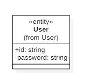
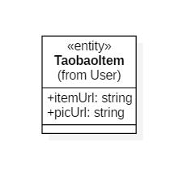
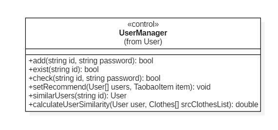
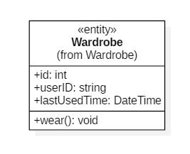
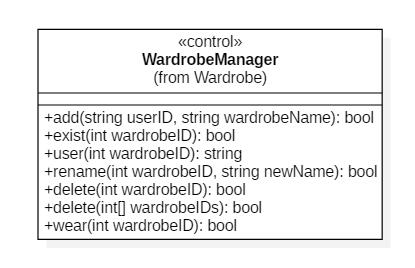
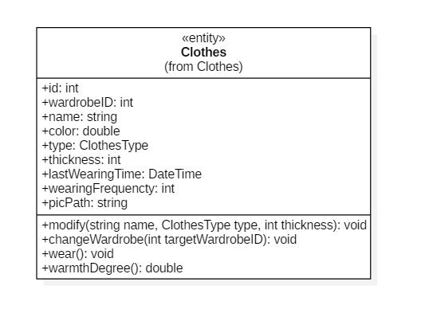
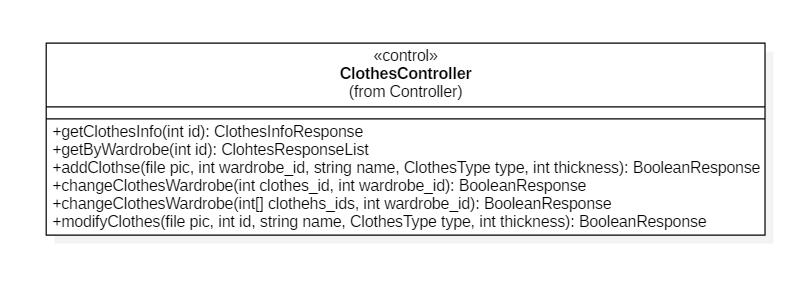
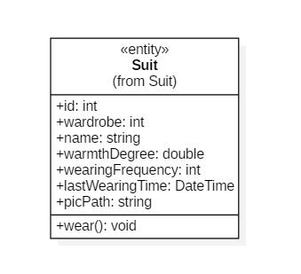
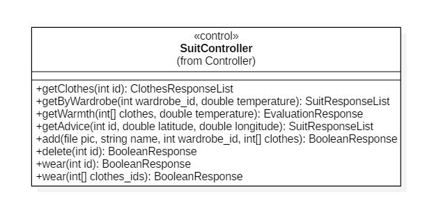

# Valet详细设计规约

1652772 肖   睿

1652712 赵欣宇

 

[TOC]

# 〇 修订历史

 

| **编写日期** | **SEPG** | **版本** | **说明** | **作者**    | **评审时间** | **评审参与人员** | **评审后修改批准日期** | **确认签字人员** |
| ------------ | -------- | -------- | -------- | ----------- | ------------ | ---------------- | ---------------------- | :--------------: |
| 2018.10.14   | VA       | 0.1      | 初稿     | 赵欣宇      | 2018.10.8    | 赵欣宇 肖睿      | 2018.10.15             |                  |
| 2018.11.29   | VA       | 1        | 定稿     | 赵欣宇 肖睿 | 2018.11.23   | 赵欣宇 肖睿      | 2018.11.30             |                  |
| 2018.12.9    | VA       | 1.1      | 修订稿   | 赵欣宇 肖睿 | 2018.12.3    | 赵欣宇 肖睿      | 2018.12.30             |                  |

 

## 一 引言

### 1编写目的

​	《详细设计书》是项目设计的第二个阶段，这个阶段的主要任务是在《概要设计书》基础上，对概要设计中产生的功能模块进行过程描述，设计功能模块的内部细节，包括类的详细逻辑和接又及类之间的调用关系，为编写源代码提供必要的说明。
​	从该阶段开发正式进入软件的实际开发阶段本阶段完成系统的大致设计并明确系统的数据结构与软件结构。在软件设计阶段主要是把一个软件需求转化为软件表示的过程，这种表示只是描绘出软件的总的概貌。
​	本文档的目的旨在推动软件工程的规范化，使设计人员遵循统一的详细设计书写规范，节省制作文档的时间，降低系统实现的风险，做到系统设计资料的规范性与全面性，以利于系统的实现、测试、维护、版本升级等。也就是进一步细化软件设计阶段得出的软件总体概貌把它加工成在程序细节上非常接近于源程序的软件表示。
​	概要设计解决了软件系统总体结构设计的问题，包括整个软件系统的结构、模块划分、模块功能和模块间的联系等。详细设计则要解决如何实现各个模块的内部功能，即模块设计。具体的说，模块设计就是要详细描述各模块中包含的类的处理逻辑及其提供接又的参数格式、请求方式。但这并不等同于系统实现阶段用具体的语言编码，它只是对实现细节作精确的描述，这样编码阶段就可以将详细设计中对功能实现的描述，直接翻译、转化为用某种程序设计语言书写的程序。详细设计的详细程度，应达到可以编写程序的水平。

### 2背景与依据

本项目是一个致力于为用户日常管理衣物，选择穿搭提供便利的Android移动端衣橱管理APP。APP主要具有四大功能模块：注册登录模块、穿搭模块、衣物管理模块、衣橱管理模块。用户可以实现对衣物的数据化管理，从多个维度对自己的衣橱、穿搭进行管理，并获得根据天气的穿搭推荐、根据用户喜好的购衣推荐等一系列定制化的推荐。

本文档内容依据《概要设计规约》，在其基础上进行撰写和校订。本文档内的设计类图基于需求分析规约中的分析类图。

### 3参考资料

[1]《Valet 需求规约》

[2]《Valet 需求分析规约》

[3]《Valet 概要设计规约》

## 二 系统软件结构

以下内容同《Valet 概要设计规约》

### 2.1 系统包图

#### 2.1.1 Data Access Package

该包负责数据的持久化存储，包括 MySQL 子系统和服务器运行平台的文件系统两部分。其中文件系统主要负责存储系统中所有多媒体内容，包括但不限于用户上传的衣物图片、穿搭图片等，以及对图片进行压缩时的本地缓存。MySQL 数据库负责对其余系统相关数据进行存储。

#### 2.1.2 ORM Package

ORM 包主要负责建立持久化存储数据和软件运行时数据对象间的映射，封装 MySQL 数据库相关操作并提供一体化高灵活度的数据操作方式。

#### 2.1.3 Model Package

该包包含一系列实体类以及各功能模块的控制类，实现了系统的核心业务逻辑，其接收来自 Controller 包中控制器的业务请求，使用 ORM 包封装的数据库操作接口处理数据并将处理结果返回给 Controller 包中的控制器。

#### 2.1.4 Controller Package

该包由各模块控制器组成，负责向 Http Service 包提供接口服务。其根据收到的服务请求创建对应的Model并将其操作结果返回给 Http Service 包。在整个业务流程中 Controller 包中的控制器只负责提供各功能模块的请求接口，并创建对应的Model然后将处理结果信息返回。

#### 2.1.5 Http Response Package

该包由一系列实体类组成，这些实体类定义了前端和后端发送信息的数据格式。

#### 2.1.6 Http Service Package

该包由一系列接口类组成，这些接口类定义了前端和后端之间的数据接口的参数和返回值类型格式，并通过Retrofit框架实现Http请求的发送和返回值解析。

#### 2.1.7 View Package

该包负责整个系统的页面展示，包含一系列安卓系统 Activity，Fragment 以及 Adapter，为数据的呈现和用户交互提供了支持，并且对用户输入数据进行了一些简单的合法性验证。

### 2.2 类调用关系图

#### 2.2.1 用户模块

[用户模块-设计类图]

用户部分的类主要实现的系统功能为新用户的注册，用户信息验证以及获取用户推荐宝贝信息。

该部分包括两个界面类 Login Activity 和 Register Activity 负责接收用户的注册和登录输入数据信息，并进行一些简单的合法性验证，以及登录和注册的结果显示和界面跳转。

User，Taobao Item 以及 User Manager 负责实现该部分系统功能业务逻辑，由 User Controller 负责界面类与实体类之间的信息沟通，接收来自界面类的请求，创建 User Manager 和 User ，并将处理结果返回。

#### 2.2.2 衣橱管理模块

[衣橱管理模块-设计类图]

衣橱管理部分主要实现了新建衣橱，删除衣橱功能。

该部分包括两个界面类 Manage Wardrobe Activity 和 Wardrobe Recycler View Adapter 负责处理用户交互，其中Wardrobe Recycler View Adapter 主要为 Manage Wardrobe Activity 所对应的衣橱管理界面的衣橱列表的用户交互行为进行支持。

Wardrobe 和 Wardrobe Manager 实现了衣橱相关系统功能的业务逻辑，由 Wardrobe Controller 负责 边界类和实体类之间的信息沟通。

#### 2.2.3 衣物管理模块

[衣物管理模块-设计类图]

衣物管理部分主要实现了新建衣物，删除衣物和修改衣物功能。

该部分包括四个界面类 Manage Clothes Activity ， Edit Clothes Activity ， Add Clothes Activity 以及 Clothes Recycler View Adapter，其中 Clothes Recycler View Adapter 主要为 Manage Clothes Activity 所对应的衣物管理界面的衣物列表的用户交互行为进行支持。

Clothes Type 为枚举类，记录和定义了系统所支持的衣物类型。Clothes 和 Clothes Manager 类实现了该部分系统功能的业务逻辑，由 Clothes Controller 负责边界类和实体类之间的信息沟通。

#### 2.2.4 穿搭管理模块

[穿搭管理模块 - 设计类图]

穿搭管理部分主要实现了推荐今日穿搭，选择今日穿搭，新建穿搭以及删除穿搭功能。

该部分包括六个界面类 Main Activity， Add New Suit Activity ， Wear Suit Activity ， Best Suit Fragment ， Suit Clothes List Adapter ， Wear Suit Recycler View Adapter，其中Best Suit Fragment 负责 Main Activity 所对应主界面中的今日最适穿搭卡片的用户交互，Wear Suit Recycler View Adapter 负责了主界面中的穿搭列表的用户交互，Suit Clothes List 负责对 Wear Suit Activity 所对应的查看穿搭衣物详情页面的衣物列表的用户交互行为提供支持。

Suit ，Clothes_Suit ，Suit Manager 实现了该部分系统功能的业务逻辑，其中 Clothes_Suit 负责处理由Clothes 到 Suit 之间的对应关系。其中获取天气信息相关功能可能会用到 Utils 包中的 Weather Api 工具类。Suit Controller 负责该部分边界类和实体类之间的信息沟通。

#### 2.2.5 Http 接口请求类

[Http接口请求 - 设计类图]

该部分包括对 Retrofit 框架进行封装的 Retrofit Client 类以及各模块 Http 接口定义类。

该部分为界面类定义了后端 Http 服务的接口规范，界面类通过调用该部分接口实现和控制类的信息沟通。

#### 2.2.6 Http 接口响应类

[Http接口响应 - 设计类图]

该部分包括各模块 Http 接口响应格式，为界面类和控制类定义了接口的响应格式规范，控制类通过该部分类生成接口返回值，界面类通过该部分类解析来自控制类的返回值信息，从而规范化了前后端的信息沟通。

#### 2.2.7 工具类和项目配置类

[工具类项目配置类 - 设计类图]

该部分包含了实现系统功能业务逻辑所需的工具类，以及设置系统配置信息的配置类。

其中 Http Util 类为各模块封装了 Http Get 请求，Image Util 类封装了图片压缩功能，Taobao Api 类封装了从淘宝识图API获取淘宝宝贝信息的接口，Weather Api 类封装了天气信息获取功能。

Config 类集中存储了系统运行的配置信息，包括数据库连接字符串、天气信息获取路径、淘宝商品搜索路径等。

​	由于系统中的类的方法基本为静态方式调用，业务逻辑相关控制类无实例化，因此不在此单独作出其状态图，系统级状态图参考需求分析规约中行为模型部分。

### 3.1 用户模块

#### 3.1.1 User 用户实体类

##### 3.1.1.1 类描述

该类对应了系统运行过程中的实际用户，记录了用户的用户名和密码信息。

##### 3.1.1.2 功能

该类主要作为系统中用户信息存储的实体模型，为系统其他类的用户相关操作提供便利。

##### 3.1.1.3 输入接口

该类仅为信息存储和传递的实体模型，无输入接口。

##### 3.1.1.4 输出接口

该类仅为信息存储和传递的实体模型，无输出接口。

##### 3.1.1.5 类属性描述

string id - 类所对应用户的用户名

string password - 类所对应用户的密码

##### 3.1.1.6 方法详细描述

该类仅为信息存储和传递的实体模型，无方法。

#### 3.1.2 TaobaoItem 淘宝宝贝实体类

##### 3.1.2.1 类描述

该类对应了淘宝网所售卖的宝贝，记录了该宝贝的宝贝链接和图片地址。

##### 3.1.2.2 功能

该类主要作为淘宝宝贝的实体模型，为系统其他类的推荐宝贝相关操作提供便利。

##### 3.1.2.3 输入接口

该类仅为信息存储和传递的实体模型，无输入接口。

##### 3.1.2.4 输出接口

该类仅为信息存储和传递的实体模型，无输出接口。

##### 3.1.2.5 类属性描述

string itemUrl - 淘宝宝贝的宝贝地址

string picUrl - 淘宝宝贝的图片地址

##### 3.1.2.6 方法详细描述

该类仅为信息存储和传递的实体模型，无方法。

#### 3.1.3 UserManager 用户管理控制类

##### 3.1.3.1 类描述

该类为用户模块的控制类，为其他模块使用用户模块功能提供了接口，同时内部实现了一些用户操作相关业务逻辑。

##### 3.1.3.2 功能

用户模块的大部分功能由用户管理控制类实现，包括以下功能：

新建用户，用户名存在检查，用户密码校验，相似用户匹配搜索，计算用户相似度。

##### 3.1.3.3 性能

系统对该类中部分功能性能要求较高，包括用户名存在检查、用户密码校验以及新建用户。以上三个功能由于涉及用户交互，如果处理速度过慢对用户体验会有较大影响，因此需要能够保证在0.5s内完成相关信息处理并做出响应。

对于相似用户匹配搜索和计算用户相似度功能，由于这两项功能一般处于服务器后台运行状态，对用户体验影响较小，因此对这两项功能的性能要求较低，保证每次操作在十分钟内完成即可。

##### 3.1.3.4 输入接口

###### 3.1.3.4.1 add() 新建用户

接口说明：

通过该接口可以新建指定用户名和密码的用户并返回新用户创建结果

###### 3.1.3.4.2 setRecommend() 设置推荐信息

接口说明：

通过该接口可以设置指定用户的购衣推荐信息

##### 3.1.3.5 输出接口

###### 3.1.3.5.1 exist() 用户名存在检查

接口说明：

通过该接口可以获取指定用户名是否存在的检查结果

###### 3.1.3.5.2 check() 用户名密码校验

接口说明：

通过该接口可以获取指定用户名密码的正确性和匹配性检查结果

###### 3.1.3.5.3 calculateUserSimilarity() 用户相似度计算

接口说明：

通过该接口可以获取指定用户之间的相似度指数

##### 3.1.3.6 属性详细描述

由于该类为用户模块的控制类，主要为其他模块提供接口以及实现逻辑功能，因此该类没有属性

##### 3.1.3.7 方法详细描述

###### 3.1.3.7.1 add() 新建用户

参数：

string id - 要新建的用户ID

string password - 要新建的用户密码

返回值：

bool 操作结果 是否新建成功

说明：

该方法功能为新建系统用户。将创建一个User类并存入数据库中。

###### 3.1.3.7.2 exist() 用户名存在检查

参数：

string id - 要查找的用户名

返回值：

bool 查找结果 对应ID的用户是否存在

说明：

该方法功能为获取指定用户名密码的正确性和匹配性检查结果。

###### 3.1.3.7.3 check() 用户名密码校验

参数：

string id - 用于校验的用户名

string password - 用于校验的密码

返回值：

bool 校验结果 用户名密码是否正确

说明：

该方法功能为检查用户名和密码是否存在且匹配。

### 3.2 衣橱管理模块

#### 3.2.1 Wardrobe 衣橱实体类

##### 3.1.1.1 类描述

该类对应了系统运行过程中的用户所创建的衣橱，记录了衣橱的编号等基本信息。

##### 3.1.1.2 功能

该类主要作为系统中衣橱信息存储的实体模型，为系统其他类的衣橱相关操作提供便利。

##### 3.1.1.3 输入接口

该类仅为信息存储和传递的实体模型，无输入接口。

##### 3.1.1.4 输出接口

该类仅为信息存储和传递的实体模型，无输出接口。

##### 3.1.1.5 类属性描述

int id - 类所对应衣橱的程序内ID

string userID - 衣橱所属的用户的ID

DateTime lastUsedTime - 衣橱的最后使用时间

##### 3.1.1.6 方法详细描述

###### 3.1.1.6.1 wear() 穿着衣橱中衣物

参数：无

返回值：void

说明：

用户选择今日穿搭之后对其所穿着穿搭所属衣橱需要进行穿着操作，即更新其最后使用时间，对该方法的调用将更新本衣橱的最后使用时间。

#### 3.2.2 WardrobeManager 衣橱管理控制类

##### 3.2.2.1 类描述

该类为衣橱管理模块的控制类，为其他模块使用衣橱管理模块功能提供了接口，同时内部实现了一些衣橱管理操作相关业务逻辑。

##### 3.2.2.2 功能

衣橱管理模块的大部分功能由衣橱管理控制类实现，包括以下功能：

新建衣橱，衣橱存在性检查，获取用户所有衣橱，删除衣橱，穿着衣橱内衣物。

##### 3.2.2.3 性能

系统对该类中功能性能要求较高，特别是获取用户所有衣橱为系统使用频率最高的操作之一，该功能以保证能在低负载情况下0.5s内完成操作并返回响应为设计目标。其与功能由于也涉及用户交互，如果处理速度过慢对用户体验会有较大影响，因此需要能够保证在1.5s内完成相关信息处理并做出响应。

##### 3.2.2.4 输入接口

###### 3.2.2.4.1 add() 新建衣橱

接口说明：

通过该接口可以新建指定名称的衣橱并返回衣橱创建结果

###### 3.2.2.4.2 delete() 删除衣橱

接口说明：

通过该接口可以删除指定名称的衣橱并返回衣橱删除结果

###### 3.2.2.4.3 wear() 穿着衣橱内衣物

接口说明：

通过该接口可以穿着指定衣橱内衣物，即更新衣橱的最后穿着时间信息

##### 3.2.2.5 输出接口

###### 3.2.2.5.1 exist() 衣橱存在检查

接口说明：

通过该接口可以获取指定衣橱是否存在的检查结果

###### 3.2.2.5.2 user() 获取用户的衣橱列表

接口说明：

通过该接口可以获取指定用户的所有衣橱列表

##### 3.2.2.6 属性详细描述

由于该类为衣橱管理模块的控制类，主要为其他模块提供接口以及实现逻辑功能，因此该类没有属性

##### 3.2.2.7 方法详细描述

###### 3.2.2.7.1 add() 新建衣橱

参数：

string userID - 新建衣橱的所属用户ID

string wardrobeName - 新建衣橱的名称

返回值：

bool 新建结果 新建操作是否成功

说明：

该方法可以新建指定名称的衣橱并返回衣橱创建结果。

### 3.3 衣物管理模块

#### 3.3.1 Clothes 衣物实体类

##### 3.3.1.1 类描述

该类对应了系统运行过程中的用户所添加进衣橱的衣物，记录了衣物的编号等基本信息。

##### 3.3.1.2 功能

该类主要作为系统中衣物信息存储的实体模型，为系统其他类的衣物相关操作提供便利。以及实现简单的修改衣物信息，切换衣物衣橱等业务逻辑。

##### 3.3.1.3 输入接口

###### 3.3.1.3.1 wear() 穿着衣物

接口说明：

通过该接口将更新衣物的最后穿着时间。

##### 3.3.1.4 输出接口

###### 3.3.1.4.1 warmthDegree() 获取衣物保暖指数

接口说明：

通过该接口将获取到衣物的御寒指数信息。

##### 3.3.1.5 类属性描述

int id - 衣物的程序内ID

int wardrobeID - 衣物所属的衣橱ID

string name - 衣物的名称

double color - 衣物的主题色Hue值

ClothesType type - 衣物的类型

int thickness - 衣物的厚度指数

DateTime lastWearingTime - 衣物的最后穿着时间

int wearingFrequency - 衣物的穿着次数

string picPath - 衣物的图片路径

##### 3.3.1.6 方法详细描述

###### 3.3.1.6.1 wear() 穿着衣物

参数：无

返回值：void

说明：

用户选择今日穿搭之后对其所穿着穿搭所属衣橱需要进行穿着操作，即更新其最后使用时间，对该方法的调用将更新本衣橱的最后使用时间。

#### 3.3.2 ClothesController 衣物管理控制类

##### 3.2.2.1 类描述

该类为衣物管理模块的控制类，为其他模块使用衣物管理模块功能提供了接口，同时内部实现了一些衣物管理操作相关业务逻辑。

##### 3.2.2.2 功能

衣物管理模块的大部分功能由衣物管理控制类实现，包括以下功能：

获取衣物信息，获取指定衣橱所有衣物，添加衣物，切换衣物衣橱，修改衣物。

##### 3.2.2.3 性能

系统对该类中功能性能要求较高，特别是获取衣橱中所有衣物为系统使用频率最高的操作之一，该功能以保证能在低负载情况下0.5s内完成操作并返回响应为设计目标。其与功能由于也涉及用户交互，如果处理速度过慢对用户体验会有较大影响，因此需要能够保证在1.5s内完成相关信息处理并做出响应。

##### 3.2.2.4 输入接口

###### 3.2.2.4.1 add() 新建衣物

接口说明：

通过该接口可以新建衣物，并返回衣物创建结果

##### 3.2.2.5 输出接口

###### 3.2.2.5.1 getClothesInfo()

接口说明：

通过该接口可以获取指定衣物的详细信息

##### 3.2.2.6 属性详细描述

由于该类为衣物模块的控制类，主要为其他模块提供接口以及实现逻辑功能，因此该类没有属性

##### 3.2.2.7 方法详细描述

###### 3.2.2.7.1 getByWardrobe() 获取指定衣橱的所有衣物列表

参数：

int id - 获取的目标衣橱ID

返回值：

ClothesResponseList 搜索到的目标衣橱内所有衣物列表

说明：

该方法可以检索到指定衣橱内的所有衣物列表。

### 3.4穿搭管理模块

#### 3.4.1 Suit 穿搭实体类

##### 3.4.1.1 类描述

该类对应了系统运行过程中的用户所添加进衣橱的穿搭，记录了穿搭的编号等基本信息。

##### 3.4.1.2 功能

该类主要作为系统中穿搭信息存储的实体模型，为系统其他类的穿搭相关操作提供便利。以及实现简单的穿着穿搭业务逻辑。

##### 3.4.1.3 输入接口

###### 3.4.1.3.1 wear() 穿着穿搭

接口说明：

通过该接口将更新穿搭的最后穿着时间。

##### 3.4.1.4 输出接口

该类仅为信息存储和传递的实体模型，无输出接口。

##### 3.4.1.5 类属性描述

int id - 穿搭的程序内ID

int wardrobe - 穿搭所属的衣橱ID

string name - 穿搭的名称

double warmthDegree - 穿搭的目标适宜温度

int wearingFrequency - 穿搭的穿着次数

DateTime lastWearingTime - 穿搭的最后穿着时间

string picPath - 穿搭的图片存储路径

##### 3.4.1.6 方法详细描述

###### 3.4.1.6.1 wear() 穿着穿搭

参数：无

返回值：void

说明：

该方法用于更新穿搭的最后穿着时间和穿着次数信息，用户选择今日穿搭之后需要通过该接口更新穿搭的相关穿着信息。

#### 3.4.2 SuitManager 穿搭管理控制类

##### 3.4.2.1 类描述

该类为穿搭管理模块的控制类，为其他模块使用穿搭管理模块功能提供了接口，同时内部实现了一些穿搭管理操作相关业务逻辑。

##### 3.4.2.2 功能

穿搭管理模块的大部分功能由穿搭管理控制类实现，包括以下功能：

获取穿搭的衣物列表，根据衣橱获取穿搭列表，获取穿搭保暖信息，获取穿搭推荐，新建穿搭，删除穿搭，穿着穿搭。

##### 3.4.2.3 性能

系统对该类中功能性能要求较高，特别是获取衣橱中所有衣物为系统使用频率最高的操作之一，该功能以保证能在低负载情况下0.5s内完成操作并返回响应为设计目标。其与功能由于也涉及用户交互，如果处理速度过慢对用户体验会有较大影响，因此需要能够保证在1.5s内完成相关信息处理并做出响应。

##### 3.4.2.4 输入接口

###### 3.4.2.4.1 add() 新建穿搭

接口说明：

通过该接口可以新建穿搭，并返回穿搭创建结果

##### 3.4.2.5 输出接口

###### 3.4.2.5.1 getClothes() 获取穿搭衣物列表

接口说明：

通过该接口可以获取指定穿搭的衣物列表信息

##### 3.4.2.6 属性详细描述

由于该类为穿搭管理模块的控制类，主要为其他模块提供接口以及实现逻辑功能，因此该类没有属性

##### 3.4.2.7 方法详细描述

###### 3.4.2.7.1 regenerateWarmthDegreeByClothes() 更新衣物所属穿搭保暖信息

参数：

int clothesID - 指定的衣物ID

返回值：void

说明：

根据指定衣物ID找到所属的所有穿搭并对所有穿搭重新计算其保暖指数信息，用户修改了衣物信息之后需要对该衣物所属的所有穿搭的保暖信息记录进行更新，需要根据新的衣物信息进行重新计算。

